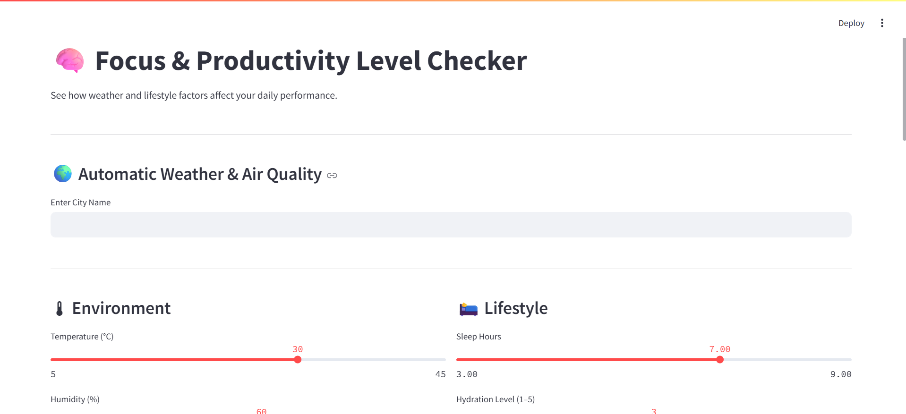
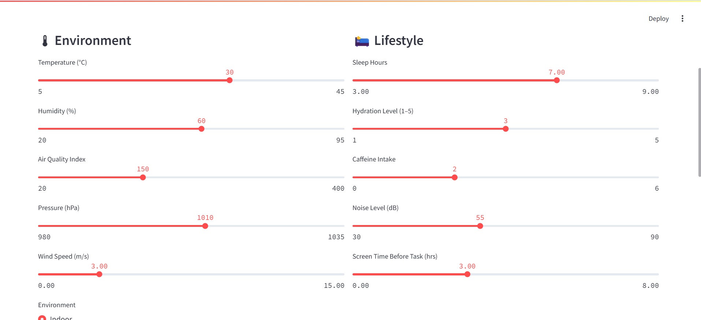
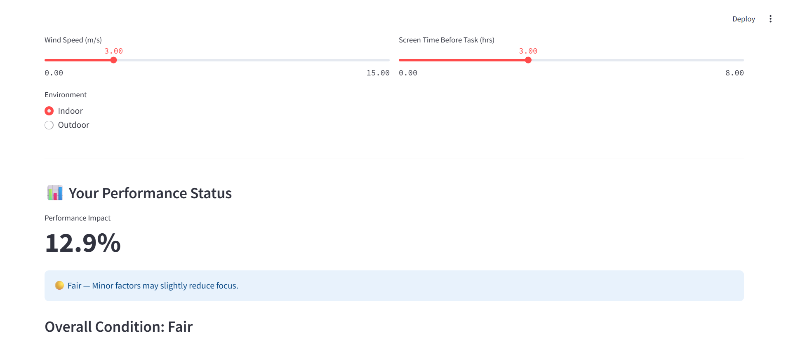
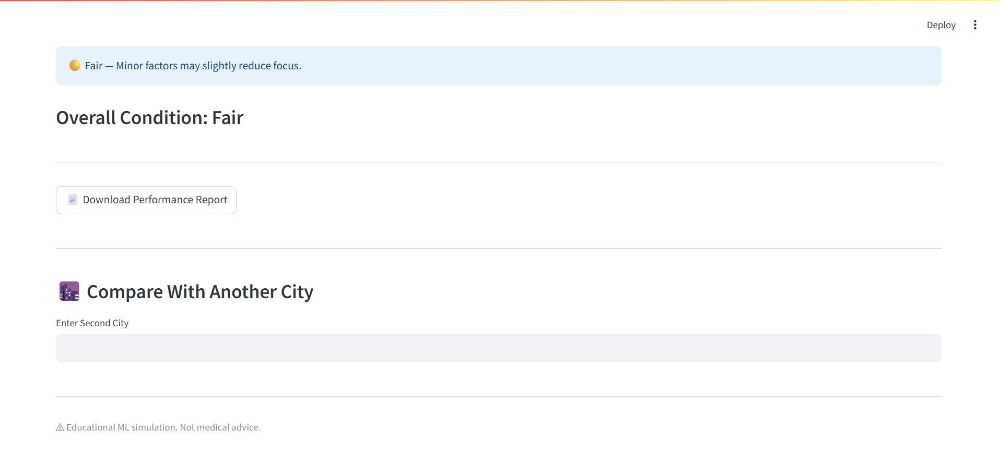
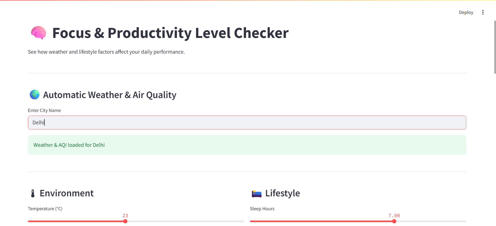
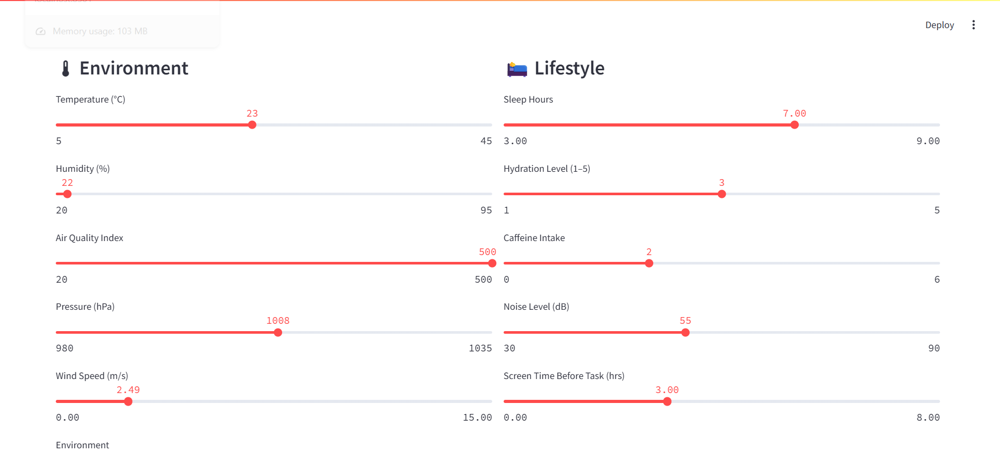
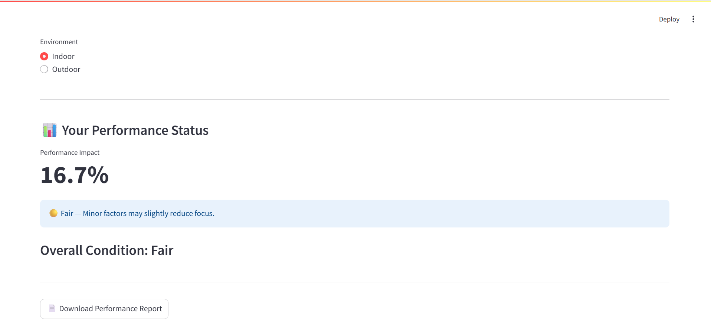
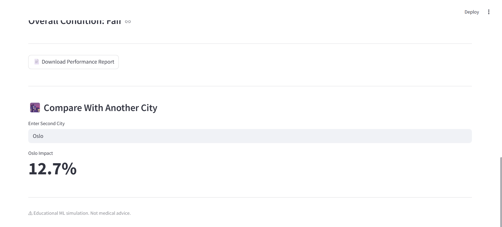

# 🧠 AI Focus & Productivity Predictor


An AI-powered web application that predicts how environmental and lifestyle factors impact human focus and productivity.

This project integrates:
- 🌍 Real-time Weather Data (OpenWeather API)
- 🌫 Real-time Air Quality (AQI)
- 🧠 Machine Learning (Random Forest Regressor)
- 📊 Human-readable Performance Status
- 📄 Downloadable PDF Reports
- 🌆 City-to-City Comparison Mode

---

## 🚀 Live Demo

👉 (Add your Streamlit deployment link here after deployment)

---

## 📸 Application Preview

### 📝 Input Interfaces






---

### 📊 Output & Performance Results






---

## 🎯 What This Project Does

The model estimates:

> How much current weather conditions and daily habits may reduce focus and productivity.

The output includes:
- 📊 Performance Impact Percentage
- 🟢 Status Classification (Excellent / Fair / Poor / Very Poor)
- 📄 Downloadable Performance Report
- 🌆 City Comparison Mode

Higher percentage = greater reduction in productivity.

---

## 🧠 Machine Learning Pipeline

1. Synthetic dataset generation (8000 samples)
2. Nonlinear target engineering (performance degradation modeling)
3. Train-Test split
4. Feature scaling (StandardScaler)
5. Ridge Regression (baseline model)
6. Random Forest Regressor (primary model)
7. Model evaluation (R², RMSE)
8. Model compression for deployment
9. Streamlit-based deployment

---

## 📊 Visualizations Included (Notebook)

- Correlation Heatmap
- Random Forest Feature Importance Plot
- Data Distribution Overview

Notebook file:
ai_focus_productivity_model.ipynb

---

## 🏗 Project Structure

```
AI-Focus-Productivity-Predictor/
│
├── app.py
├── ai_focus_productivity_model.ipynb
├── requirements.txt
├── README.md
├── .gitignore
│
├── model/
│   ├── random_forest_model_compressed.pkl
│   ├── best_ridge_model.pkl
│   └── scaler.pkl
│
└── screenshots/
    ├── input1.png
    ├── input2.png
    ├── input3.png
    ├── input4.png
    ├── output1.png
    ├── output2.png
    ├── output3.png
    └── output4.png
```

---

## 🔐 API Key Setup (Local Development)

Create a `.env` file in the project root:

OPENWEATHER_API_KEY=your_api_key_here

Install dotenv:

pip install python-dotenv

The app reads the key using:

api_key = os.getenv("OPENWEATHER_API_KEY")

---

## ☁ Deployment (Streamlit Cloud)

1. Push repository to GitHub
2. Go to https://streamlit.io/cloud
3. Connect GitHub repository
4. Select `app.py`
5. Add secret in Streamlit Cloud:

OPENWEATHER_API_KEY = your_api_key_here

6. Deploy

---

## 📦 Installation (Local)

```
git clone https://github.com/AryanDekate12/AI-Focus-Productivity-Predictor.git
cd AI-Focus-Productivity-Predictor
pip install -r requirements.txt
streamlit run app.py
```

---

## 🛠 Tech Stack

- Python
- Scikit-learn
- Streamlit
- NumPy & Pandas
- Matplotlib & Seaborn
- ReportLab (PDF generation)
- OpenWeather API

---

## ⚠ Disclaimer

This project is an educational machine learning simulation and does not provide medical or psychological advice.

---

## 👨‍💻 Author

Developed by Aryan Dekate  
www.linkedin.com/in/aryan-dekate-1b1129288
